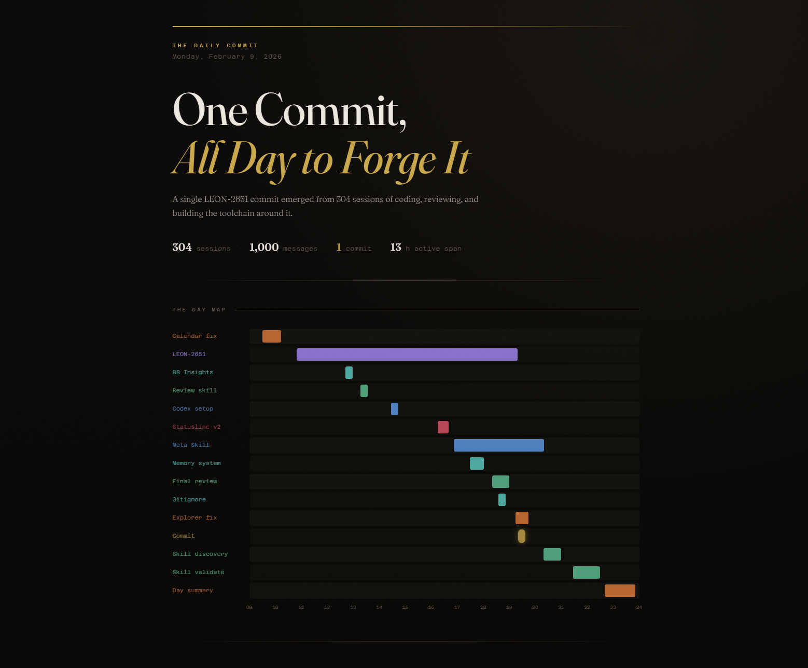

# Coding Day Recap

A [Claude Code](https://docs.anthropic.com/en/docs/claude-code) skill that generates a visual HTML dashboard summarizing your daily AI coding sessions. It mines session data from [CASS](https://github.com/Dicklesworthstone/coding_agent_session_search), reads sessions deeply to build an accurate narrative, and produces a self-contained dark-themed dashboard.



## What it does

1. **Gathers quantitative data** — session counts, hourly activity distribution, workspace breakdown, agent breakdown
2. **Reads sessions deeply** — launches parallel subagents to read the START, MIDDLE, and END of each significant session
3. **Builds an accurate narrative** — distinguishes "coded" from "reviewed" from "committed", traces activity threads across sessions, checks git history for ground truth
4. **Generates an HTML dashboard** — dark-themed, self-contained, with a Day Map swimlane visualization, journal feed, workspace breakdown, and a hero stat

## Prerequisites

- **[Claude Code](https://docs.anthropic.com/en/docs/claude-code)** — the CLI tool by Anthropic
- **[CASS](https://github.com/Dicklesworthstone/coding_agent_session_search)** — Coding Agent Session Search. Indexes sessions from Claude Code, Cursor, Codex, Gemini, and more
- **Python 3** — required for the HTML generation script (ships with macOS; included with CASS on other platforms)

## Platform

**macOS, Linux, Windows** — all scripts are Python, no platform-specific dependencies.

## Installation

1. Install [CASS](https://github.com/Dicklesworthstone/coding_agent_session_search) and index your sessions:
   ```bash
   pip install cass
   cass index
   ```

2. Clone this repo:
   ```bash
   git clone https://github.com/Gabko14/Coding-Day-Recap.git
   ```

3. Symlink to your Claude Code skills directory:
   ```bash
   # Create skills directory if it doesn't exist
   mkdir -p ~/.claude/skills

   # macOS / Linux (symlink — stays in sync with git pulls)
   ln -s /path/to/Coding-Day-Recap ~/.claude/skills/day-summary
   ```
   ```powershell
   # Windows (junction — stays in sync with git pulls)
   New-Item -ItemType Junction -Path "$HOME\.claude\skills\day-summary" -Target "C:\path\to\Coding-Day-Recap"
   ```

4. Verify the skill appears in Claude Code:
   ```
   /day-summary today
   ```

## Usage

In Claude Code, invoke the skill with a date:

```
/day-summary today
/day-summary yesterday
/day-summary 2026-02-09
```

The skill will:
1. Index your CASS data
2. Launch parallel subagents to deeply read your sessions
3. Synthesize findings into a coherent timeline
4. Generate an HTML dashboard on your Desktop
5. Open it in your browser

## Subagent Architecture

The skill launches independent subagents in parallel (one per time block + one for git history + one for browser history). Each subagent uses `model: "haiku"` for cost efficiency, keeping the main session on your preferred model (e.g., Opus) while running the read-heavy session scanning on Haiku.

The main agent synthesizes their findings — merging cross-block threads, deduplicating overlapping activities, and resolving conflicts.

> **Note:** If your `~/.claude/settings.json` has a global `"model"` override, it will take precedence over the per-subagent `model` parameter. Remove the global override if you want subagents to run on Haiku.

## How it works

### Phase 1: Quantitative Data
Runs CASS queries to gather session counts, hourly distribution, workspace/agent breakdowns.

### Phase 2: Narrative Building
The critical phase. Launches independent subagents in parallel — one per time block (morning, midday, afternoon, evening) plus a git history checker and a browser history reader. Each reader uses pre-extracted session data to deeply read sessions at multiple points. The main agent synthesizes findings — merging cross-block threads, deduplicating overlapping activities, resolving conflicts.

Key accuracy rules:
- **Check git history** to distinguish "coded today" from "committed code written last week"
- **Trace activities across sessions**, not within — many activities span multiple sessions
- **Name activities by what was done**, never by session size or tools used

### Phase 3: HTML Generation
Writes a data JSON file following the schema in `scripts/generate_html.py`, then generates a self-contained HTML dashboard with:
- **Day Map** — swimlane visualization showing activity bands across the day
- **Journal Feed** — detailed cards for each activity with descriptions and tags
- **Workspace Breakdown** — which repos got the most activity
- **Hero Stat** — the most striking number of the day

## File Structure

```
Coding-Day-Recap/
├── SKILL.md                # Claude Code skill definition
├── scripts/
│   ├── generate_html.py    # JSON → HTML generator
│   ├── pre_extract.py      # Batch CASS session extraction
│   └── browser_history.py  # Browser history extraction (Chrome/Edge)
├── assets/
│   └── template.html       # HTML/CSS template
├── examples/
│   └── screenshot.png      # Example dashboard
├── LICENSE
└── README.md
```

## License

MIT
